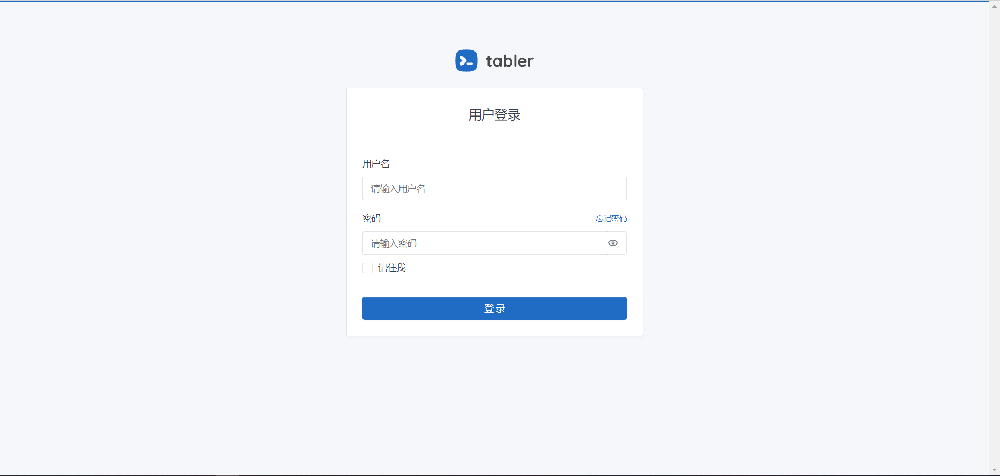
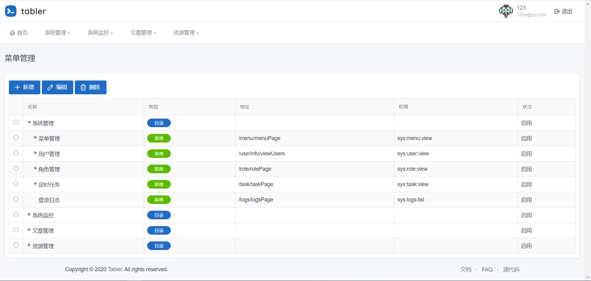
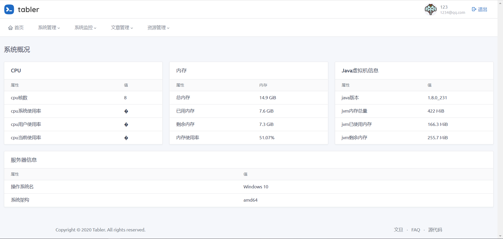
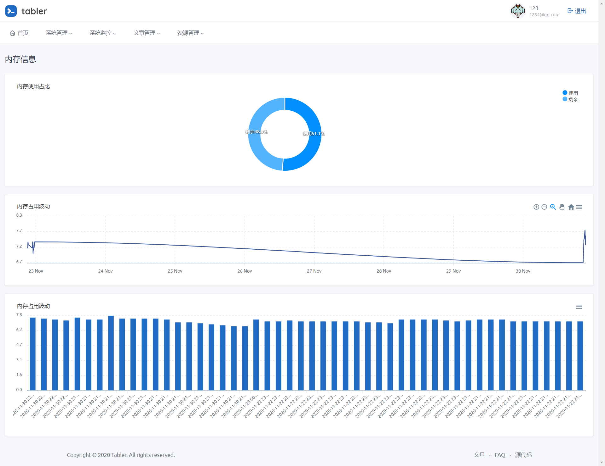
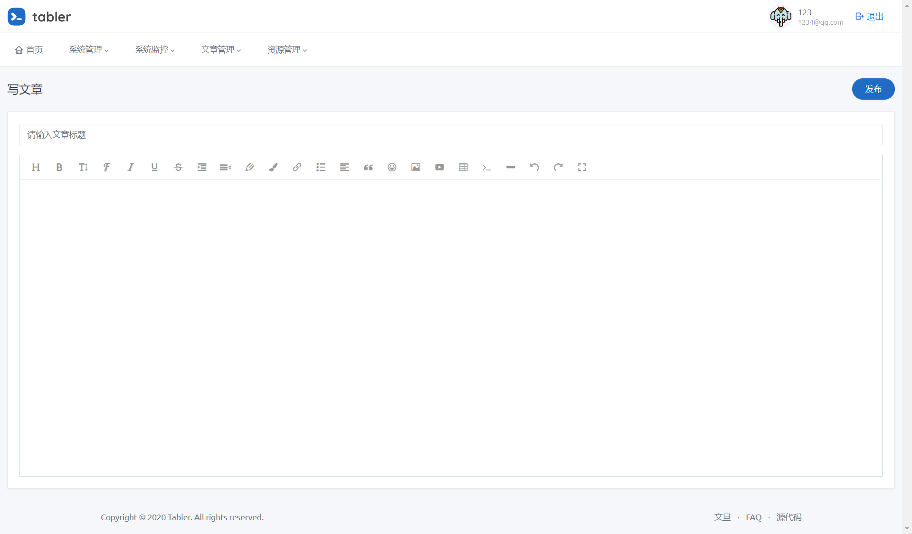

### 项目说明
* 基于SpringBoot的网站内容管理系统
* 可视化的管理定时任务
* model、mapper、mapper.xml代码生成器
* 系统运行监控

### 功能概述
* 用户管理
* 角色管理
* 定时任务管理
* 基于MinIO的文件管理
* 基于Quartz的定时任务管理
* 登录日志管理
* 邮箱重置密码

### 登录
* 用户名：123
* 密码：123

### 技术选型
#### 后端
* SpringBoot框架
* Thymeleaf模板引擎
* Quartz定时任务
* Shiro安全框架
* Knife4j文档工具
* MinIo存储服务
* Oshi
* HuTool工具集
* 通用Mapper插件
* PageHelper分页插件
* lombok

#### 前端
* wangeditor编辑器
* Ztree树形组件
* LayUI弹出层
* Table框架
* ...

### 系统截图
* 登录

* 菜单管理

* 系统概况

* 系统运行波动

* 文章编辑

